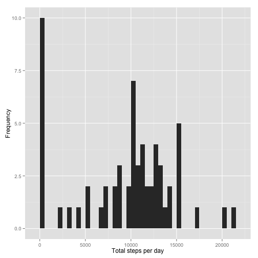
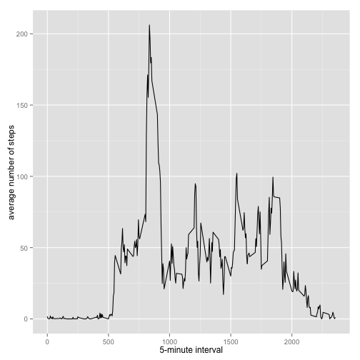
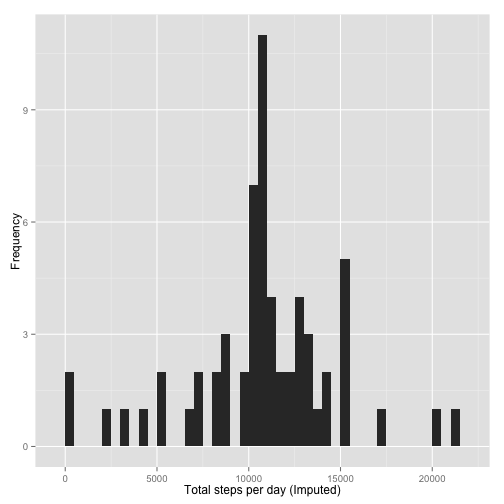
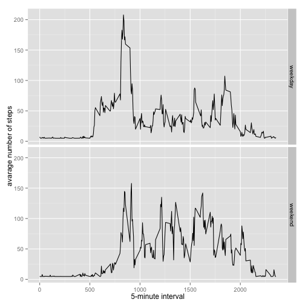

Reproducible Research: Peer Assessment 1
========================================
## Purpose of this document
This is the first peer-assessed assignment for the Coursera Reproducible Reseach course. It documents the steps taken to analyse data collected from a FitBit device. The steps in this analysis are:

- loading and preprocessing data
- imputing missing values
- intepreting data to answer the assignment questions

## Load Required Libraries
The following libraries will be required to answer the assignment questions:

```r
library(Hmisc)
```

```
## Loading required package: grid
## Loading required package: lattice
## Loading required package: survival
## Loading required package: Formula
## 
## Attaching package: 'Hmisc'
## 
## The following objects are masked from 'package:base':
## 
##     format.pval, round.POSIXt, trunc.POSIXt, units
```

```r
library(ggplot2)
```

## Load and Pre-processing the Data
### Load the data

```r
if(!file.exists('activity.csv')){
    unzip('activity.zip')
}
activityData <- read.csv('activity.csv')
```
### Pre-process the data

```r
activityData$date <- as.Date(activityData$date, format="%Y-%m-%d")
```

## What is mean total number of steps taken per day?

```r
stepsPerDay <- tapply(activityData$steps, activityData$date, sum, na.rm=TRUE)
```

### Histogram of total number of steps taken each day:

```r
qplot(stepsPerDay, xlab='Total steps per day', ylab='Frequency', binwidth=500)
```

 

### Calculate the mean and median of the total number of steps taken per day
The **mean** of the total steps taken per day is: 

```
## [1] 9354.23
```
The **median** of the total steps taken per day is: 

```
## [1] 10395
```

## What is the average daily activity pattern?

```r
avgStepsInt <- aggregate(x=list(meanSteps=activityData$steps), by=list(interval=activityData$interval), FUN=mean, na.rm=TRUE)
```

### Time-Series Plot of Average Steps per 5-minute Interval

```r
ggplot(data=avgStepsInt, aes(x=interval, y=meanSteps)) +
    geom_line() +
    xlab("5-minute interval") +
    ylab("average number of steps")
```

 

### Which 5-minute interval, on average across all the days in the dataset, contains the maximum number of steps?

```r
maxSteps <- which.max(avgStepsInt$meanSteps)
timeMaxSteps <- gsub("([0-9]{1,2})([0-9]{2})", "\\1:\\2", avgStepsInt[maxSteps,'interval'])
```

The **time interval** at which the average maximum number of steps occurs is:

```
## [1] "8:35"
```

## Imputing missing values

### Calculate and report the total number of missing values in the dataset

```r
numMissingValues <- length(which(is.na(activityData$steps)))
```

The total number of missing values is:

```
## [1] 2304
```

### Devise a strategy for filling in all of the missing values in the dataset
The missing values will be replaced by the mean of the steps, excluding NAs.

### Create a new dataset that is equal to the original dataset but with the missing data filled in

```r
activityDataImputed <- activityData
activityDataImputed$steps <- impute(activityData$steps, fun=mean)
```

### Make a histogram of the total number of steps taken each day

```r
stepsPerDayImputed <- tapply(activityDataImputed$steps, activityDataImputed$date, sum)
qplot(stepsPerDayImputed, xlab='Total steps per day (Imputed)', ylab='Frequency', binwidth=500)
```

 

### Calculate and report the mean and median total number of steps taken per day
The **mean** of the total steps taken per day, WITH IMPUTED DATA, is: 

```
## [1] 10766.19
```
The **median** of the total steps taken per day, WITH IMPUTED DATA, is: 

```
## [1] 10766.19
```

## Are there differences in activity patterns between weekdays and weekends?

### Create a new factor variable in the dataset with two levels – “weekday” and “weekend” indicating whether a given date is a weekday or weekend day

```r
activityDataImputed$dateType <-  ifelse(as.POSIXlt(activityDataImputed$date)$wday %in% c(0,6), 'weekend', 'weekday')
```

### Make a panel plot containing a time series plot

```r
avgStepsIntImputed <- aggregate(steps ~ interval + dateType, data=activityDataImputed, mean)
ggplot(avgStepsIntImputed, aes(interval, steps)) + 
    geom_line() + 
    facet_grid(dateType ~ .) +
    xlab("5-minute interval") + 
    ylab("avarage number of steps")
```

 
